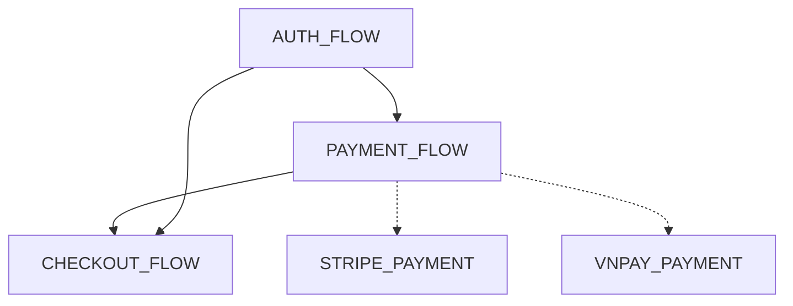

# ATS Protocol V4 — DAG Architecture Plan

## Goal

Evolve `flow_graph.json` from a flat flow map into a **Directed Acyclic Graph (DAG)** that captures flow dependencies, sub-flows, and method call chains. The system must be **self-learning** — the graph fills in naturally as AI agents work with the project, not through manual CLI commands.

### Core Principle

```
App runs → ATS.trace() outputs structured logs → AI reads logs → AI understands flow
                                                       ↓
                                             AI fixes bugs / builds features
                                                       ↓
                                             AI updates flow_graph.json
                                                       ↓
                                               ats sync (auto)
                                                       ↓
                                             Graph grows smarter
```

**CLI stays minimal:** Only `ats init`, `ats sync`, and `ats graph` (visualization). Everything else is AI-driven through SKILL.md rules.

---

## Phase 1: Schema Evolution

### 1.1 Add `depends_on` — Flow-Level DAG

Each flow declares which flows it depends on.

```json
"CHECKOUT_FLOW": {
  "depends_on": ["PAYMENT_FLOW", "AUTH_FLOW"],
  ...
}
```

Rules:
- Optional field. Omitting it = standalone flow.
- Circular dependencies are invalid.
- AI declares `depends_on` when it creates or updates a flow.
- When AI activates a flow for debugging, it reads `depends_on` to understand upstream context.

### 1.2 Add `parent` — Sub-flow Hierarchy

A flow can declare a parent flow, creating a tree structure.

```json
"STRIPE_PAYMENT": {
  "parent": "PAYMENT_FLOW",
  ...
},
"VNPAY_PAYMENT": {
  "parent": "PAYMENT_FLOW",
  ...
}
```

Rules:
- Optional. Omitting = top-level flow.
- A flow has at most one parent.
- Activating a parent does NOT auto-activate children.

### 1.3 Add `edges` — Method-Level Call Chain

A top-level array describing how methods connect across flows.

```json
"edges": [
  {
    "from": "CheckoutBloc.onPaymentConfirmed",
    "to": "PaymentService.processPayment",
    "type": "calls"
  },
  {
    "from": "PaymentService.processPayment",
    "to": "StripeGateway.charge",
    "type": "delegates",
    "condition": "provider == stripe"
  }
]
```

Edge types:

| Type | Meaning |
|---|---|
| `calls` | Direct method invocation |
| `delegates` | Forwards to implementation (strategy/factory) |
| `emits` | Fires an event another method listens to |
| `navigates` | Triggers screen/route navigation |

Rules:
- `edges` is **optional and accumulated over time**.
- AI adds edges when it **naturally discovers call chains during debugging**.
- AI is NOT required to add edges for every method it instruments.
- `condition` is optional, describes when this edge is taken.

### 1.4 Add `sessions` — Debug History

Each flow records a log of AI debug sessions.

```json
"PAYMENT_FLOW": {
  "sessions": [
    {
      "date": "2025-04-10",
      "action": "debug",
      "note": "Fixed race condition in processPayment when Stripe webhook arrives before redirect",
      "resolved": true
    },
    {
      "date": "2025-04-15",
      "action": "refactor",
      "note": "Extracted VNPay logic into separate gateway class"
    }
  ]
}
```

This is institutional memory. Next AI session reads past notes and doesn't repeat work.

### 1.5 Add `needs_verify` + `last_verified` — Staleness Tracking

```json
"PaymentService": {
  "methods": ["processPayment", "refund"],
  "needs_verify": true,
  "last_verified": "2025-03-01"
}
```

- `needs_verify: true` means the AI should open the source file and verify method names before trusting the graph.
- `last_verified` records when an AI last confirmed this class matches source code.
- If `last_verified` is older than 30 days → treat as `needs_verify: true`.

### 1.6 Full Schema Example

```json
{
  "ats_version": "4.0.0",
  "project": "my_ecommerce_app",
  "updated_at": "2025-04-15T10:00:00Z",

  "flows": {
    "AUTH_FLOW": {
      "description": "Authentication, registration, token management",
      "active": false,
      "classes": {
        "AuthService": {
          "methods": ["login", "logout", "refreshToken"],
          "last_verified": "2025-04-15"
        },
        "UserService": {
          "methods": ["getUser", "validateSession"],
          "last_verified": "2025-04-15"
        }
      }
    },
    "PAYMENT_FLOW": {
      "description": "Core payment processing",
      "active": false,
      "depends_on": ["AUTH_FLOW"],
      "classes": {
        "PaymentService": {
          "methods": ["processPayment", "refund", "getStatus"],
          "last_verified": "2025-04-10"
        }
      },
      "sessions": [
        {
          "date": "2025-04-10",
          "action": "debug",
          "note": "Fixed timeout issue in refund callback",
          "resolved": true
        }
      ]
    },
    "STRIPE_PAYMENT": {
      "description": "Stripe gateway implementation",
      "active": false,
      "parent": "PAYMENT_FLOW",
      "classes": {
        "StripeGateway": {
          "methods": ["charge", "createIntent", "handleWebhook"],
          "last_verified": "2025-04-10"
        }
      }
    },
    "CHECKOUT_FLOW": {
      "description": "Cart → payment → confirmation journey",
      "active": false,
      "depends_on": ["PAYMENT_FLOW", "AUTH_FLOW"],
      "classes": {
        "CheckoutBloc": {
          "methods": ["onCheckoutStarted", "onPaymentConfirmed", "onOrderComplete"],
          "last_verified": "2025-04-15"
        },
        "CartService": {
          "methods": ["calculateTotal", "applyDiscount"],
          "last_verified": "2025-04-15"
        }
      }
    }
  },

  "edges": [
    { "from": "CheckoutBloc.onPaymentConfirmed", "to": "PaymentService.processPayment", "type": "calls" },
    { "from": "PaymentService.processPayment", "to": "StripeGateway.charge", "type": "delegates", "condition": "provider == stripe" },
    { "from": "PaymentService.processPayment", "to": "AuthService.refreshToken", "type": "calls", "condition": "token expired" }
  ]
}
```

### 1.7 Backward Compatibility

- All new fields (`depends_on`, `parent`, `edges`, `sessions`, `needs_verify`, `last_verified`) are optional.
- Existing V3 `flow_graph.json` files work without modification.
- CLI detects `ats_version` and handles both V3 and V4 schemas.
- V3 classes format (`"ClassName": ["method1", "method2"]`) is auto-migrated to V4 object format on first `ats sync`.

---

## Phase 2: Smart Log Output

### 2.1 Add Sequence Number + Depth to `ATS.trace()`

Current log output:
```
[ATS][PAYMENT_FLOW] PaymentService.processPayment | {amount: 150000}
```

New log output with sequence + depth (flow name preserved):
```
[ATS][CHECKOUT_FLOW][#001][d0] CheckoutBloc.onCheckoutStarted | {cartId: 123}
[ATS][CHECKOUT_FLOW][#002][d1] CartService.validateItems | {count: 3}
[ATS][CHECKOUT_FLOW][#003][d1] CartService.calculateTotal | {total: 450000}
[ATS][CHECKOUT_FLOW][#004][d0] CheckoutBloc.onPaymentConfirmed | {method: stripe}
[ATS][PAYMENT_FLOW][#005][d1] PaymentService.processPayment | {amount: 450000}
[ATS][PAYMENT_FLOW][#006][d2] StripeGateway.charge | {intent: pi_xxx}
[ATS][PAYMENT_FLOW][#007][d1] PaymentService.getStatus | {status: success}
[ATS][CHECKOUT_FLOW][#008][d0] CheckoutBloc.onOrderComplete | {orderId: ORD-789}
```

- `[FLOW_NAME]` — Which flow this method belongs to.
- `#NNN` — Global sequence number (resets per session). Shows execution order.
- `dN` — Call depth. Shows nesting level.

If a method belongs to multiple flows, it logs once per active flow:
```
[ATS][AUTH_FLOW][#010][d1] UserService.getUser | {userId: 42}
[ATS][PROFILE_FLOW][#010][d1] UserService.getUser | {userId: 42}
```

### 2.2 Why This Matters

AI reads the log and **automatically infers edges**:
- `#004 d0` followed by `#005 d1` → `onPaymentConfirmed` calls `processPayment`
- `#005 d1` followed by `#006 d2` → `processPayment` calls `StripeGateway.charge`

**No one needs to declare edges manually.** The runtime log IS the edge data. AI observes actual behavior and updates the graph.

### 2.3 Implementation

```dart
class _AtsSequencer {
  static int _seq = 0;
  static int _depth = 0;

  static int nextSeq() => ++_seq;

  // Depth is inferred from stack frame count delta
  // or managed via zone-based tracking
  static int currentDepth() => _depth;

  static void reset() { _seq = 0; _depth = 0; }
}
```

Sequence number resets on Hot Restart. Depth is best-effort — exact depth tracking in async Dart code is imperfect, but approximate depth is good enough for AI to infer call chains.

---

## Phase 3: Graph Drift Protection

### 3.1 The Problem

Dev renames `processPayment` → `process`. Graph still says `processPayment`. AI trusts graph → wastes time looking for a method that doesn't exist.

### 3.2 Three Layers of Protection

**Layer 1: Logs reveal drift automatically**

App runs with PAYMENT_FLOW active. If `processPayment` was renamed, one of two things happens:
- `ATS.trace()` string wasn't updated → log still says `processPayment` but source file has `process` → AI opens file, sees mismatch → drift detected.
- `ATS.trace()` was deleted during rename → no log appears for that method → AI notices: "Graph says this method should log, but I see nothing" → drift detected.

No extra code needed. Logs are the built-in drift detector.

**Layer 2: `needs_verify` + `last_verified` flags**

When `last_verified` is old or `needs_verify: true`, AI opens the source file before trusting the graph. After verification, AI either:
- Confirms: sets `needs_verify: false`, updates `last_verified`.
- Finds drift: updates method list, adds session note explaining what changed.

**Layer 3: SKILL.md Safe Update Rules**

See section below.

### 3.3 Safe Update Rules for AI Agents

These rules go into SKILL.md to prevent AI from making wrong corrections:

```
## Graph Update Safety Rules

### Rule 1: Verify Before Trust
Before modifying code in a class listed in flow_graph.json:
- Open the actual source file.
- Compare method names in the file vs in the graph.
- If they differ → update graph FIRST, then proceed with your task.

### Rule 2: Rename > Delete
If graph says `processPayment` but code says `process` in the same class:
✅ Rename in graph: processPayment → process
✅ Update any edges referencing the old name
❌ Do NOT delete the old entry and create a new one
   (deleting loses edge history and session notes)

### Rule 3: Only Fix Flows You're Working On
If you're debugging PAYMENT_FLOW:
✅ Fix method names for classes in PAYMENT_FLOW
❌ Do NOT update AUTH_FLOW just because you "noticed something"
   (you haven't read AUTH_FLOW source code, you lack context)

### Rule 4: When Unsure, Mark for Verification
If you can't confirm whether a method still exists:
✅ Set "needs_verify": true on that class
❌ Do NOT remove the method from the graph

### Rule 5: Always Log Changes
When updating the graph, add a session entry:
{
  "date": "YYYY-MM-DD",
  "action": "update",
  "note": "Renamed processPayment → process after dev refactor"
}
```

---

## Phase 4: CLI Changes (Minimal)

### Keep These

| Command | Purpose |
|---|---|
| `ats init` | One-time project setup |
| `ats sync` | Compile flow_graph.json → generated Dart code |
| `ats activate <FLOW>` | Toggle flow active (convenience, AI can also edit JSON directly) |
| `ats silence <FLOW>` | Toggle flow inactive |
| `ats status` | Show flow states (quick reference) |
| `ats graph` | Export Mermaid diagram for visualization |

### Remove / Don't Build

| Command | Why not |
|---|---|
| `ats impact` | AI infers this from edges + depends_on in graph |
| `ats doctor` | AI does this via Rule 1 (verify before trust) |
| `ats hotspots` | AI infers this from edge density in graph |
| `ats suggest` | AI infers this from import analysis when reading code |
| `ats context` | AI reads depends_on + does topo-sort internally |
| `ats validate` | Cycle detection runs automatically during `ats sync` |
| `--cascade` | AI decides whether to activate upstream flows based on SKILL.md guidance |

### New: `ats graph`

```bash
ats graph                    # Print Mermaid flow-level diagram to stdout
ats graph --methods          # Include method-level edges
ats graph --output graph.md  # Save to file
```

Output example:


### Update: `ats sync` — Auto Cycle Detection

When `ats sync` compiles the graph, it automatically:
1. Validates `depends_on` has no circular dependencies (Kahn's algorithm).
2. Validates `edges` have no cycles.
3. Validates all edge references point to existing methods.
4. Prints warnings for any issues found.
5. Generates Dart code as before.

No separate `ats validate` command needed.

---

## Phase 5: SKILL.md Updates

Update AI agent instructions to include:

1. **Graph verification** — Rule 1-5 from Safe Update Rules.
2. **Session logging** — After every debug session, add a `sessions` entry.
3. **Edge discovery** — When reading logs with sequence/depth, note call chains and add `edges` to graph.
4. **Dependency declaration** — When creating a new flow, set `depends_on` based on which flows it imports from.
5. **Sub-flow creation** — When a flow has distinct implementation variants, create sub-flows with `parent`.

---

## Implementation Order

| Step | What | Effort | Priority |
|---|---|---|---|
| 1 | Update `flow_graph_schema.json` with `depends_on`, `parent`, `edges`, `sessions`, `needs_verify`, `last_verified` | Small | P0 |
| 2 | Update `_generateDartCode` to handle new schema (backward compatible) | Small | P0 |
| 3 | Add sequence + depth to `ATS.trace()` log output | Medium | P0 |
| 4 | Add cycle detection to `ats sync` | Medium | P1 |
| 5 | Add `ats graph` command (Mermaid export) | Medium | P1 |
| 6 | Update SKILL.md with safe update rules + edge discovery | Small | P0 |
| 7 | Update `spec/protocol.md` for V4 | Small | P1 |
| 8 | Migrate V3 class format to V4 object format in `ats sync` | Medium | P1 |

---

## Design Decisions (Resolved)

### Q1: Should `ats activate --cascade` be default?
**No.** Cascade is opt-in. ATS's value is precise, targeted logging. AI decides when to activate upstream flows based on SKILL.md guidance, not forced by the system.

### Q2: Should AI be required to add edges every time?
**No.** `edges` accumulate naturally. `depends_on` at flow level is recommended when creating flows. Method-level edges are added when AI discovers call chains during debugging. Never forced.

### Q3: Max depth for context traversal?
**Not a CLI concern.** AI reads `depends_on` and decides how deep to go based on the task. SKILL.md suggests: "For focused debugging, read immediate dependencies. For architecture understanding, traverse the full graph."
