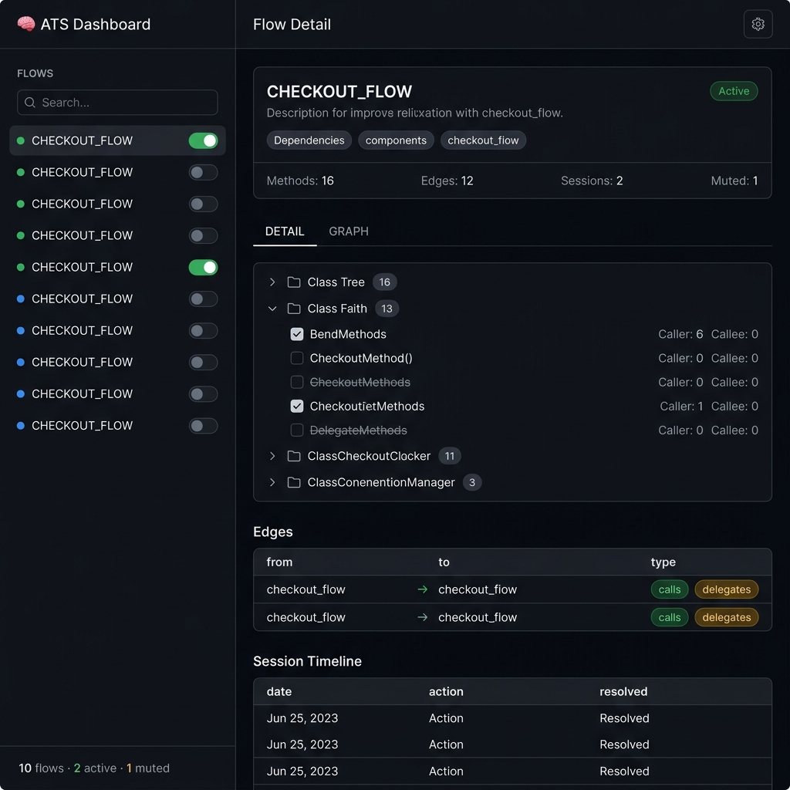

# ATS Web Dashboard — Interactive Flow Control (V3 Plan)

## Problem

The current web visualization is **read-only** — a D3 graph you can look at but not control. Meanwhile, real-world debugging creates this pain:

```
flutter: [ATS][PIVOT_FLOW][#5616][d3] MatrixRow.addRow | {level: 0}
flutter: [ATS][PIVOT_FLOW][#5617][d4] MatrixColumn.addColumn | {level: 0}
flutter: [ATS][PIVOT_FLOW][#5618][d4] MatrixColumn.addValue | {metricId: a405f...}  ← ×500
flutter: [ATS][PIVOT_FLOW][#5619][d3] MatrixRow.addRow | {level: 0}
flutter: [ATS][PIVOT_FLOW][#5620][d4] MatrixColumn.addColumn | {level: 0}
flutter: [ATS][PIVOT_FLOW][#5621][d4] MatrixColumn.addValue | {metricId: a405f...}  ← ×500
```

`MatrixColumn.addValue` fires 500+ times per render. Developer needs to **mute that one method** while keeping the rest of the flow active. Today this requires editing JSON + CLI + restart. Unacceptable.

**Goal:** Interactive web dashboard where you toggle flows, mute methods, and see details — with one click.

---

## Scope (No Live Log View)

| Feature | Description | Status |
|---|---|---|
| ✅ Flow List + Toggle | Sidebar with all flows, click to activate/silence | Build |
| ✅ Flow Detail View | Click flow → see classes, methods, edges, sessions | Build |
| ✅ Method Muting | Checkbox per method to suppress noisy traces | Build |
| ✅ Graph View Tab | Enhanced D3 graph, click node → navigate | Build |
| ❌ ~~Live Log View~~ | ~~WebSocket log streaming~~ | Dropped |

---

## Full Impact Analysis: Method Muting

Adding `muted` field to a method impacts the **entire stack**. Here's every file that needs to change:

### Layer 1: Protocol Spec

| File | Change | Why |
|---|---|---|
| `spec/protocol.md` | Add `muted` field to Class Definition table | Protocol contract |
| `spec/flow_graph_schema.json` | Add `muted` array to class schema | JSON validation |

### Layer 2: Flow Graph JSON Schema

```diff
 "classes": {
   "MatrixColumn": {
     "methods": ["addColumn", "addValue"],
+    "muted": ["addValue"],
     "last_verified": "2026-04-16"
   }
 }
```

`muted` is a subset of `methods` — methods that exist in the graph but are suppressed from logging.

### Layer 3: Flutter SDK — Runtime

| File | Change | LOC |
|---|---|---|
| `ats_core.dart` | Add `_mutedMethods` set + check in `trace()` + new `internalInit()` param | ~10 |
| `flow_registry.dart` | Store muted set, expose via `isMuted(key)` | ~15 |

```diff
 // ats_core.dart
+static Set<String> _mutedMethods = {};

 static void trace(String className, String methodName, {dynamic data}) {
   if (kReleaseMode || !_initialized || _registry == null) return;
+  if (_mutedMethods.contains('$className.$methodName')) return; // O(1)
   final flows = _registry!.getFlowsForMethod(className, methodName);
   ...
 }

-static Future<void> internalInit(
-  Map<String, List<String>> staticMap,
-  List<String> activeFlows,
-) async {
+static Future<void> internalInit(
+  Map<String, List<String>> staticMap,
+  List<String> activeFlows, [
+  Set<String>? mutedMethods,
+]) async {
   if (kReleaseMode) return;
   if (_initialized) return;
   _registry = FlowRegistry.fromNative(staticMap, activeFlows);
+  _mutedMethods = mutedMethods ?? {};
   _writer = await LogWriter.create();
   _initialized = true;
 }
```

### Layer 4: Flutter SDK — CodeGen (CLI)

| File | Change | LOC |
|---|---|---|
| `cli/runner.dart` `_generateDartCode()` | Emit `_kMutedMethods` set from JSON `muted` arrays | ~20 |

Generated code becomes:

```dart
// AUTO-GENERATED BY ATS CLI (V4)
import 'package:ats_flutter/ats_flutter.dart';

const _kMethodMap = <String, List<String>>{
  'MatrixColumn.addColumn': ['PIVOT_FLOW'],
  'MatrixColumn.addValue': ['PIVOT_FLOW'],
};

const _kActiveFlows = <String>['PIVOT_FLOW'];

const _kMutedMethods = <String>{            // ← NEW
  'MatrixColumn.addValue',
};

abstract class AtsGenerated {
  static void init() {
    ATS.resetSequence();
    ATS.internalInit(_kMethodMap, _kActiveFlows, _kMutedMethods);  // ← UPDATED
  }
}
```

### Layer 5: Flutter SDK — CLI Commands

| File | Change | LOC |
|---|---|---|
| `cli/runner.dart` | Add `ats mute <CLASS.METHOD>` and `ats unmute <CLASS.METHOD>` commands | ~50 |

```bash
ats mute MatrixColumn.addValue     # Add to muted array + sync
ats unmute MatrixColumn.addValue   # Remove from muted array + sync
ats status                         # Show muted methods count
```

### Layer 6: MCP Server — TypeScript

| File | Change | LOC |
|---|---|---|
| `core/flow-graph.ts` | Add `muted?: string[]` to FlowEntry interface | 1 |
| `tools/instrument.ts` | Don't instrument muted methods (or mark them) | ~5 |
| `tools/context.ts` | Include muted info in context response | ~5 |
| `web/web-server.ts` | **Full rewrite** → Dashboard with API endpoints | ~800 |

New API endpoints:

| Endpoint | Method | Description |
|---|---|---|
| `GET /` | — | Dashboard HTML (SPA) |
| `GET /api/flows` | — | Flow list with stats |
| `GET /api/flows/:name` | — | Flow detail |
| `GET /api/graph` | — | D3 graph data (existing, enhanced) |
| `POST /api/flows/:name/toggle` | body: `{active: bool}` | Toggle flow + sync |
| `POST /api/methods/mute` | body: `{class, method}` | Mute method + sync |
| `POST /api/methods/unmute` | body: `{class, method}` | Unmute method + sync |

### Layer 7: Tests

| File | Change |
|---|---|
| `test/ats_flutter_test.dart` | Add tests for muted methods: muted method produces no output |
| (New) `test/mute_test.dart` | Test mute/unmute via codegen round-trip |

### Layer 8: Documentation

| File | Change |
|---|---|
| `spec/protocol.md` | Add `muted` to class definition |
| `docs/architecture.md` | Add muting to runtime flow diagram |
| `docs/flow.md` | Add muting workflow example |
| `docs/setup.md` | Add CLI mute/unmute commands |
| `packages/ats_flutter/README.md` | Add muting section |
| `packages/ats-mcp-server/README.md` | Add dashboard section |

### Layer 9: AI Skills

| File | Change |
|---|---|
| `skills/antigravity/SKILL.md` | Teach AI about muted methods: when to mute, how to mute |
| `skills/claude/CLAUDE.md` | Same |
| `templates/rules/*.md` | Add mute rule |
| `templates/workflows/ats-instrument.md` | Reference muting for noisy methods |

---

## UI/UX Design Specification

### Mockup



### Design Reference

Aesthetic inspired by **Linear**, **Vercel Dashboard**, and **GitHub Dark Mode** — minimal, professional, developer-focused. Not flashy, not gamified. Clean information hierarchy that a senior engineer would respect.

---

### Design System

#### Color Palette

| Token | Hex | Usage |
|---|---|---|
| `--bg` | `#0d1117` | Page background |
| `--surface` | `#161b22` | Cards, sidebar, panels |
| `--surface-hover` | `#1c2333` | Hover states |
| `--surface-active` | `#1f2a3d` | Selected item in sidebar |
| `--border` | `#30363d` | Card borders, dividers |
| `--border-subtle` | `#21262d` | Inner dividers |
| `--text-primary` | `#e6edf3` | Headings, active text |
| `--text-secondary` | `#8b949e` | Descriptions, labels |
| `--text-muted` | `#484f58` | Disabled, muted text |
| `--accent` | `#58a6ff` | Links, selected tabs, focus rings |
| `--green` | `#3fb950` | Active flow, success, resolved |
| `--green-subtle` | `#1a7f37` | Active badge background |
| `--amber` | `#d29922` | Warnings, delegates edge |
| `--red` | `#f85149` | Errors, unresolved, danger |
| `--purple` | `#bc8cff` | Navigates edge type |

#### Typography

| Element | Font | Weight | Size |
|---|---|---|---|
| Page title | Inter | 600 | 18px |
| Section heading | Inter | 600 | 14px |
| Flow name (sidebar) | Inter | 500 | 13px |
| Class name | JetBrains Mono | 600 | 13px |
| Method name | JetBrains Mono | 400 | 12px |
| Body text | Inter | 400 | 13px |
| Stat numbers | Inter | 600 | 14px |
| Badges | Inter | 500 | 11px |
| Table header | Inter | 600 | 11px, uppercase, letter-spacing 0.5px |

Load via Google Fonts:
```html
<link href="https://fonts.googleapis.com/css2?family=Inter:wght@400;500;600&family=JetBrains+Mono:wght@400;600&display=swap" rel="stylesheet">
```

#### Spacing & Layout

| Token | Value |
|---|---|
| `--sidebar-width` | `240px` |
| `--spacing-xs` | `4px` |
| `--spacing-sm` | `8px` |
| `--spacing-md` | `16px` |
| `--spacing-lg` | `24px` |
| `--spacing-xl` | `32px` |
| `--radius-sm` | `6px` |
| `--radius-md` | `8px` |
| `--radius-lg` | `12px` |

---

### Component Specifications

#### C1: Top Navigation Bar

```
Height: 56px
Background: var(--surface)
Border-bottom: 1px solid var(--border)
Padding: 0 24px
Layout: flex, space-between, align-center

Left:   🧠 emoji + "ATS Dashboard" (18px, 600 weight, var(--accent))
Center: (empty)
Right:  Project name (13px, var(--text-secondary)) + ⚙ Settings icon (24px)
```

Settings icon: `opacity: 0.5` → `opacity: 1` on hover with `transition: 0.15s`.

#### C2: Sidebar — Flow List

```
Width: 240px
Background: var(--surface)
Border-right: 1px solid var(--border)
Height: calc(100vh - 56px)
Overflow-y: auto (custom scrollbar: 4px, var(--border), rounded)
```

**Header section** (sticky top):
- Label "FLOWS" — 11px, uppercase, var(--text-muted), letter-spacing 1px
- Search input — 32px height, var(--bg) background, var(--border) border, placeholder "Search flows..."
- Focus: border-color → var(--accent), subtle glow `0 0 0 2px rgba(88,166,255,0.15)`

**Flow items:**
```
Height: 44px
Padding: 0 16px
Layout: flex, align-center, space-between
Border-radius: 6px (inside 8px margin from edges)
Cursor: pointer

Left side:
  ● Status dot (8px circle)
    - Active: var(--green)
    - Inactive: var(--text-muted)
  Flow name (13px, 500 weight)
    - Selected: var(--text-primary)
    - Default: var(--text-secondary)

Right side:
  Toggle switch (iOS-style)
    - Track: 36px × 20px, border-radius 10px
    - Off: var(--border) background
    - On: var(--green) background
    - Thumb: 16px white circle, 2px inset
    - Animation: transform 200ms ease + background 200ms ease
```

**States:**
- Default: transparent background
- Hover: var(--surface-hover)
- Selected: var(--surface-active), left border 2px var(--accent)
- Toggle click: POST to API → optimistic UI update → show toast

**Footer** (sticky bottom):
```
Padding: 12px 16px
Border-top: 1px solid var(--border)
Font: 12px, var(--text-muted)
Content: "10 flows · 2 active · 1 muted"
```

#### C3: Tab Bar

```
Height: 40px
Border-bottom: 1px solid var(--border)
Layout: flex, gap 0

Tab item:
  Padding: 8px 20px
  Font: 13px, 500 weight
  Color: var(--text-secondary) → var(--text-primary) on active
  Border-bottom: 2px transparent → 2px var(--accent) on active
  Transition: all 200ms ease
  Cursor: pointer
  
Tabs: [DETAIL] [GRAPH]
```

#### C4: Flow Header Card

```
Background: var(--surface)
Border: 1px solid var(--border)
Border-radius: 12px
Padding: 20px 24px
Margin-bottom: 24px

Row 1: Flow name (18px, 600 weight, var(--text-primary))
        + Active badge (right-aligned)
          - Active: "Active" — green text on var(--green-subtle)/20% bg, 6px radius
          - Inactive: "Inactive" — var(--text-muted) on var(--border)/20% bg

Row 2: Description (13px, var(--text-secondary), margin-top 4px)

Row 3: Dependency chips (margin-top 12px)
        - Each: pill shape, var(--bg) background, var(--border) border
        - 11px, var(--text-secondary)
        - Padding: 4px 10px
        - Gap: 6px

Row 4: Stats bar (margin-top 16px, border-top 1px var(--border-subtle), padding-top 16px)
        - Layout: flex, space-between
        - Each stat: label (11px, var(--text-muted)) + value (14px, 600 weight, var(--text-primary))
        - Stats: Methods: 16, Edges: 12, Sessions: 2, Muted: 1
        - Muted count: var(--amber) if > 0
```

#### C5: Class Tree Component

```
Section heading: "CLASSES" (11px, uppercase, var(--text-muted), letter-spacing)
Background: var(--surface)
Border: 1px solid var(--border)
Border-radius: 12px
Overflow: hidden

Class header (collapsible):
  Height: 44px
  Padding: 0 16px
  Background: var(--surface)
  Cursor: pointer
  Layout: flex, align-center, space-between
  
  Left:
    Chevron icon (▶/▼) — 12px, var(--text-muted), rotation animation 200ms
    📁 Folder icon — 14px
    Class name — JetBrains Mono, 13px, 600 weight, var(--text-primary)
  
  Right:
    Badge "[4/5]" — enabled/total count
    - All enabled: var(--text-secondary)
    - Some muted: var(--amber)

  Border-bottom: 1px solid var(--border-subtle) (when expanded)
  Hover: var(--surface-hover)

Method row (inside collapsed section):
  Height: 36px
  Padding: 0 16px 0 48px (indented under class)
  Layout: flex, align-center, space-between
  
  Left:
    Checkbox (custom styled):
      - Size: 16px × 16px
      - Unchecked: var(--border) border, transparent fill
      - Checked: var(--accent) background, white checkmark
      - Transition: all 150ms ease
    Method name — JetBrains Mono, 12px, var(--text-primary)
    Muted label (if unchecked): "MUTED" badge
      - 9px, uppercase, var(--amber), var(--amber)/15% background
      - Text has strikethrough decoration
  
  Right:
    Connection info — 12px, var(--text-muted)
    "→ 2 callees" or "← 1 caller" or "↔ 3 connections"
  
  Hover: var(--surface-hover)
  Click checkbox: POST mute/unmute → optimistic toggle → toast
```

**Collapse animation:**
- `max-height` transition: 0 → auto (use JS to measure)
- `opacity`: 0 → 1, 200ms ease
- Chevron: `transform: rotate(0deg)` → `rotate(90deg)`, 200ms

#### C6: Edge Table

```
Section heading: "EDGES" + count badge
Background: var(--surface)
Border: 1px solid var(--border)
Border-radius: 12px
Overflow: hidden

Table header:
  Background: var(--bg)
  Height: 36px
  Font: 11px, uppercase, 600 weight, var(--text-muted), letter-spacing 0.5px
  Columns: From | → | To | Type
  Border-bottom: 1px solid var(--border)

Table row:
  Height: 40px
  Padding: 0 16px
  Font: JetBrains Mono, 12px
  Border-bottom: 1px solid var(--border-subtle)
  
  "From" / "To": var(--text-primary)
  Arrow "→": var(--text-muted)
  Type badge:
    - calls: var(--green) text, green/15% bg
    - delegates: var(--amber) text, amber/15% bg
    - emits: var(--red) text, red/15% bg
    - navigates: var(--purple) text, purple/15% bg
    - Pill shape, 9px, uppercase, padding 3px 8px

  Hover: var(--surface-hover)
```

#### C7: Session Timeline

```
Section heading: "SESSIONS" + count
Background: var(--surface)
Border: 1px solid var(--border)
Border-radius: 12px

Session entry:
  Padding: 16px
  Border-bottom: 1px solid var(--border-subtle) (not on last)
  
  Row 1: Layout flex, space-between
    Left: 📅 + date (13px, var(--text-secondary)) + action badge ("debug" / "refactor")
    Right: Status
      - ✅ Resolved (var(--green))
      - ❌ Unresolved (var(--red))
  
  Row 2: Note text (13px, var(--text-primary), margin-top 6px)
```

#### C8: Toast Notification

Appears after toggle/mute actions:

```
Position: fixed, bottom 24px, right 24px
Background: var(--surface)
Border: 1px solid var(--border)
Border-radius: 8px
Padding: 12px 16px
Box-shadow: 0 8px 24px rgba(0,0,0,0.4)
Min-width: 280px
Z-index: 1000

Layout: flex, align-center, gap 10px
Icon: ✓ (green) or ⚠ (amber)
Text: "CHECKOUT_FLOW activated" or "MatrixColumn.addValue muted"
Subtext: "Hot Restart to apply" (12px, var(--text-muted))

Animation:
  Enter: translateY(16px) opacity(0) → translateY(0) opacity(1), 300ms ease
  Exit: opacity(1) → opacity(0), 200ms ease (after 3s auto-dismiss)
```

---

### Interaction Patterns

#### I1: Toggle Flow

```
User clicks toggle in sidebar
  → Immediate: toggle visually switches (optimistic)
  → API: POST /api/flows/FLOW_NAME/toggle { active: true/false }
  → Success: toast "FLOW_NAME activated. Hot Restart to apply."
  → If flow detail is open: refresh header status
  → Error: revert toggle, toast with error message
```

#### I2: Mute Method

```
User unchecks method checkbox
  → Immediate: checkbox unchecks, strikethrough + "MUTED" badge appears
  → Class counter updates [4/5] with amber color
  → Sidebar footer stats update ("2 muted")
  → API: POST /api/methods/mute { className, methodName }
  → Success: toast "MatrixColumn.addValue muted. Hot Restart to apply."
  → Error: revert checkbox, show error toast
```

#### I3: Navigate Flow

```
User clicks flow name in sidebar
  → Sidebar: highlight selected flow
  → Main area: fade transition (150ms) to new flow detail
  → Scroll position resets to top
  → Tab stays on current selection (DETAIL or GRAPH)
```

#### I4: Collapse/Expand Class

```
User clicks class header row
  → Chevron rotates 90° (200ms)
  → Methods section slides open/closed (200ms, ease-out)
  → Smooth height animation (no layout jump)
```

#### I5: Graph ↔ Detail Navigation

```
User clicks GRAPH tab
  → D3 graph renders/updates (reuses cached simulation if same flow)
  → Flow nodes clickable → switches to DETAIL tab for that flow

User clicks DETAIL tab
  → Shows class tree, edges, sessions for selected flow
```

---

### Responsive Behavior

| Viewport | Sidebar | Content |
|---|---|---|
| ≥1200px | 240px fixed, visible | Full width remaining |
| 900-1199px | 200px fixed, compact (names truncated) | Adjusted |
| <900px | Collapsed to 56px (icons only), click to expand overlay | Full width |

---

### Empty States

When no flow is selected in the main area:
```
Center vertically + horizontally:
  Graph icon (48px, var(--text-muted))
  "Select a flow" (16px, var(--text-secondary))
  "Click on a flow in the sidebar to view its details" (13px, var(--text-muted))
```

---

### Loading States

```
API calls show:
  - Skeleton loading (pulse animation) for cards
  - Toggle switches show loading spinner (12px) while API is in flight
  - Buttons disabled during API calls
```

---

### Keyboard Shortcuts

| Key | Action |
|---|---|
| `↑ / ↓` | Navigate flow list |
| `Enter` | Select flow |
| `Space` | Toggle selected flow |
| `Tab` | Switch DETAIL ↔ GRAPH |
| `/` | Focus search input |
| `Esc` | Clear search / close overlay |

---

## Implementation Phases

### Phase 1: SDK Changes (Foundation)
All other phases depend on this working correctly.

- [ ] `spec/protocol.md` — Add `muted` field
- [ ] `spec/flow_graph_schema.json` — Add `muted` to schema
- [ ] `ats_core.dart` — Add `_mutedMethods` + check in `trace()`
- [ ] `flow_registry.dart` — Store + expose muted set
- [ ] `cli/runner.dart` `_generateDartCode()` — Emit `_kMutedMethods`
- [ ] `cli/runner.dart` — Add `ats mute` / `ats unmute` commands
- [ ] `test/ats_flutter_test.dart` — Add muted method tests
- [ ] `core/flow-graph.ts` — Add `muted` to FlowEntry interface

### Phase 2: Backend API
The web dashboard needs these endpoints.

- [ ] `web/web-server.ts` — Add REST API router
- [ ] `GET /api/flows` — Flow list with stats (active, muted counts)
- [ ] `GET /api/flows/:name` — Complete flow detail
- [ ] `POST /api/flows/:name/toggle` — Activate/silence + sync
- [ ] `POST /api/methods/mute` — Mute method + sync
- [ ] `POST /api/methods/unmute` — Unmute method + sync
- [ ] Sync mechanism: exec `dart run ats_flutter sync` after changes

### Phase 3: Dashboard Frontend
Replace inline HTML with full SPA.

- [ ] HTML shell — sidebar + main area + tab routing
- [ ] CSS design system — dark theme, typography, components
- [ ] Flow List sidebar — status badges, toggle switches, search
- [ ] Flow Detail view — header, class tree, method toggles
- [ ] Edge table — sortable, type badges
- [ ] Session timeline — resolved/unresolved badges

### Phase 4: Enhanced Graph View
Integrate D3 graph as a tab in the dashboard.

- [ ] Move D3 graph into Graph tab
- [ ] Click flow node → switch to Detail tab
- [ ] Muted methods → dimmed nodes
- [ ] Active flows → green highlight
- [ ] Edge type color coding (calls/delegates/emits/navigates)
- [ ] Zoom controls + minimap

### Phase 5: MCP Tool Updates
MCP tools should be aware of muted methods.

- [ ] `ats_context` — Include muted methods in response
- [ ] `ats_instrument` — Skip muted methods (or note them)
- [ ] New MCP tool? `ats_mute` / `ats_unmute` — Direct muting from AI

### Phase 6: Documentation + Skills
Update everything to reflect the new muting capability.

- [ ] `docs/architecture.md` — Add muting to runtime flow diagram
- [ ] `docs/flow.md` — Add muting workflow
- [ ] `docs/setup.md` — Add mute/unmute CLI
- [ ] `packages/ats_flutter/README.md` — Muting section
- [ ] `packages/ats-mcp-server/README.md` — Dashboard + new tools
- [ ] `skills/antigravity/SKILL.md` — Teach AI about muting
- [ ] `skills/claude/CLAUDE.md` — Same
- [ ] `templates/workflows/ats-instrument.md` — Reference muting

---

## Files Changed Summary

| Layer | Files | Est. LOC |
|---|---|---|
| Protocol spec | 2 | ~20 |
| Flutter SDK (runtime) | 2 | ~25 |
| Flutter SDK (codegen + CLI) | 1 | ~70 |
| Flutter tests | 1-2 | ~30 |
| MCP Server (TS types) | 2 | ~10 |
| MCP Server (web dashboard) | 1 (rewrite) | ~800 |
| MCP Server (tools update) | 2 | ~15 |
| Documentation | 8 | ~100 |
| AI Skills | 4 | ~40 |
| **Total** | **~23 files** | **~1,110 LOC** |

---

## Critical Path

```
Phase 1 (SDK)  ──▶  Phase 2 (API)  ──▶  Phase 3 (Frontend)  ──▶  Phase 4 (Graph)
     │                                        │
     └──▶  Phase 5 (MCP Tools)                └──▶  Phase 6 (Docs + Skills)
```

Phase 1 must be done first — everything depends on the `muted` field existing in the schema, codegen, and runtime.
